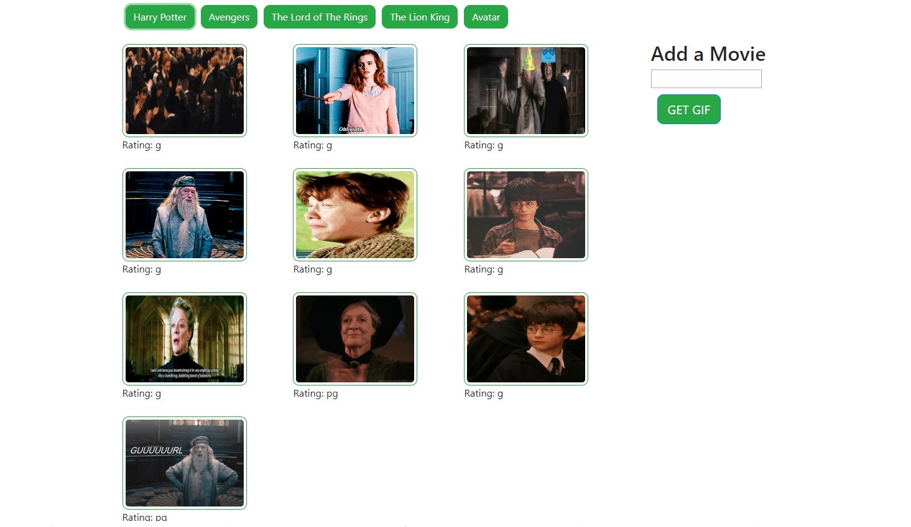

# MOVIE GIF CREATOR 

### you'll use the GIPHY API to make a dynamic web page that populates with gifs of your choice.

## Instructions

### Insert any title of your favorite Movie then click on the new button with title. 
### The button will show 10 different GIFS of your movie.  You can pause or play the gif when you want. 

## Link to the Game  https://kliche1791.github.io/gif-creator/

## ScreenShot

### Interface with GIFS
